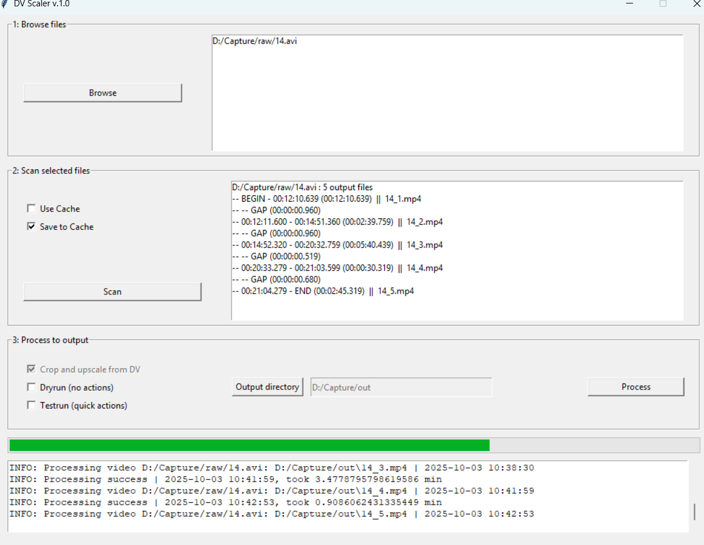

# AnalogTranscoder /  DV Scaler
*current version: 1.0*

DV Scaler offers a GUI which can take a captured DV from an .AVI container, and transcode \& transform it:
- Outputting a more manageable file size in an mp4 container using a H.264 codec
- Offering an upscaled resolution (960x720 for online display)*
- Squaring of pixels (PAR 1.067 to PAR 1, for 960x720 PAL 4:3)
- Cropping and removing edge noise and unstable borders
- YADIF deinterlacing

And most important for my use-case:
- Proper audio synchronization with captures from older \& damaged DV
- Batch scanning and processing of files

## Usage
1. Start by selecting files to be processed
2. Select options and **scan** these files. This will find cut-points (based on missing audio packets). The result will be displayed
3. Select options \& an output directory and **process** these files. This will create the files as indicated under the scan section, and offer the above listed transcoding and transformations.

## Technical
This project uses Python and ffmpeg for transforming DV. The GUI is built in tkinter. 

## Prerequisites
- Python (with tkinter)
- ffmpeg and ffprobe added to PATH

<small>*: When uploaded at the native DV resolution (576p), services like YouTube often allocate a lower bitrate, which can visibly reduce playback quality. Upscaling to a larger resolution (720p) does not add detail, but allows higher bitrate allocation, improving playback quality online.</small>